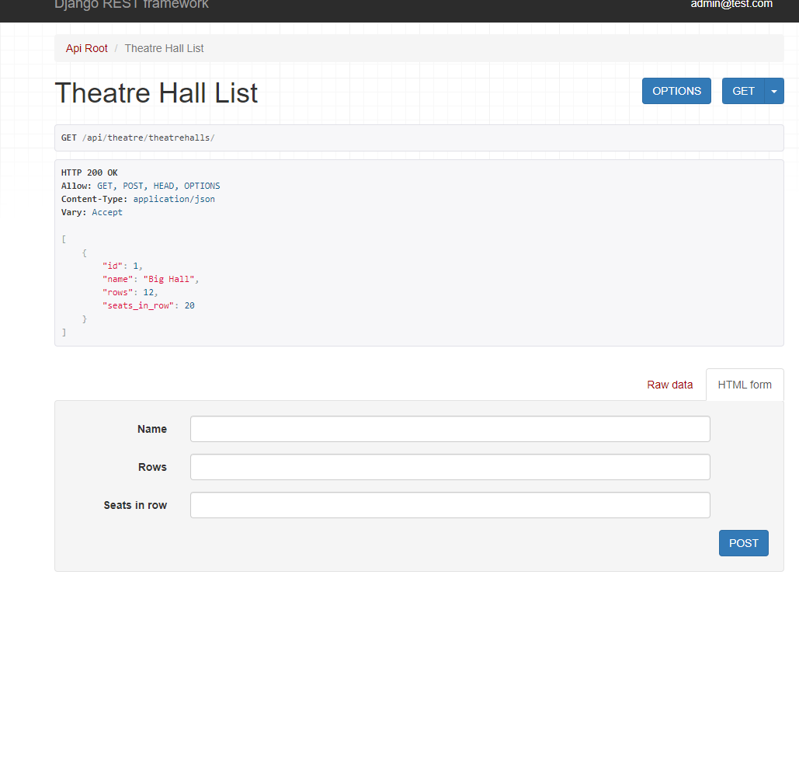

# Django RESTful API for Theatre Management

This project is a Django-based RESTful API framework designed to manage various aspects of a theatre business process. It includes models for Play, Performance, Theatre Hall Reservation, Ticket, Actor, and Genre, allowing users to efficiently handle theatre-related operations.

## Features

- **Play Management:** Create, update, and delete play information, including details such as title, description, genre, and actors involved.

- **Performance Tracking:** Keep track of performances, including date, time, theatre hall, and ticket availability.

- **Theatre Hall Reservation:** Manage theatre hall reservations for specific performances, ensuring efficient seat allocation.

- **Ticketing System:** Handle ticket availability and generate tickets for customers.

## Tech Stack

**Core**:
- Django
- Django REST Framework (DRF)
***
**DataBase**: PostgreSQL, SQLite
***
**Containerization platform:** Docker
***
**Testing:** pytest

## Quick Start

(!!Make sure Python3 is installed on your system!!)

To get started with the project, follow these steps:

1. Clone the repository to your local machine:

        git clone https://github.com/PythonZem/theatre-api-service-DRF.git

2. Navigate to the project directory:

        cd config

3. Set up a virtual environment:

        python -m venv env
        source env/bin/activate  # For Linux/Mac
        env\Scripts\activate  # For Windows

4. Install the required dependencies:

        pip install -r requirements.txt

5. Apply database migrations:

        python manage.py migrate

6. Create super user for you:

        python manage.py createsuperuser

7. Start the development server:

        python manage.py runserver

8. Access the API at http://localhost:8000/ and explore the available endpoints.

**Available urls:**

        /api/plays/

        /api/performances/

        /api/reservations/

        /api/actors/

        /api/genres/

For detailed API documentation and endpoint usage, refer to the API documentation available in the project or access **/api/doc/swagger/** when the server is running.

## User endpoints:

I used JWT in this project to manage accesses

- create user:

        /api/user/register

- get access token:

        /api/user/token

- verify access token:

        /api/user/token/verify

- refresh token:

        /api/user/token/refresh

- manage user:

        /api/user/me

## Run with docker

        docker-compose build
        ducker-compose up

## How it looks

